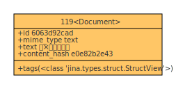
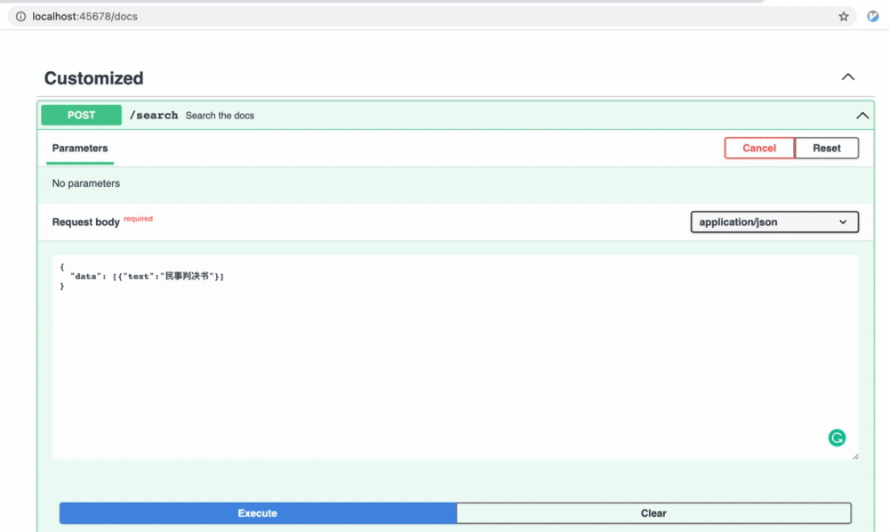

# eap-aegis
https://www.aegis-info.com/home

## Prerequisites

```
pip install -r requirements.txt
```

## Index Flow



## Query Flow


## Usage

For demonstration purpose, we use the ERNIE model to encode the `_source.title`. The same field is used for both 
indexing and querying




### Index

Index the data at `toy-data/case_parse_10.json`

```
python app.py -t index
```

### Query

Query with the data at `toy-data/case_parse_10.json`. The best match is expected to be the query Document itself 
because it is in the index.

```
python app.py -t query
```

### Query with RESTful API

Run the following command and open [http://localhost:45678/docs](http://localhost:45678/docs) in your brower.

```shell
python app.py -t query_restful
```

